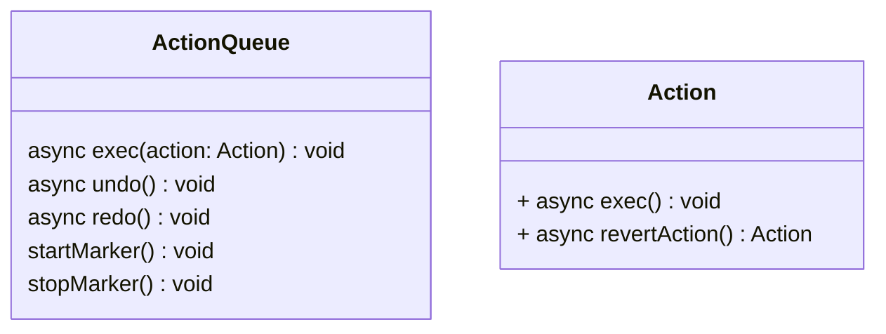
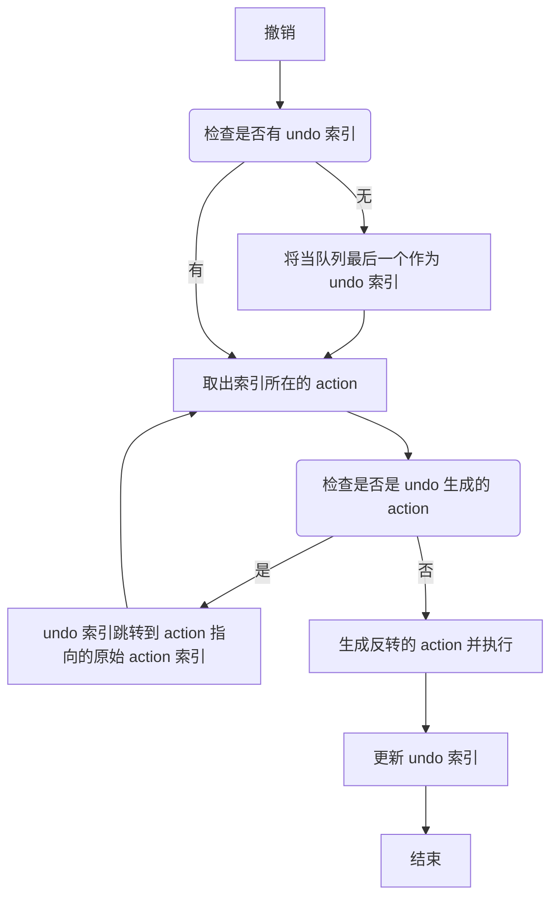
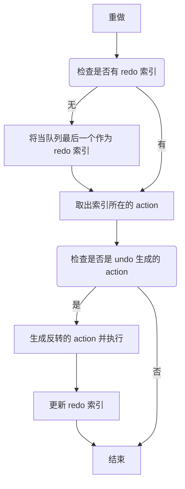

# Action

[](https://www.npmjs.com/package/@itharbors/action)
[](https://github.com/itharbors/action/actions/workflows/ci.yaml)

### 目标与范围

Action 用于描述一个操作的动作，这个管理器主要的功能就是执行某个操作，并且管理回退（undo）和重做（redo）

同时支持一些特殊场景，例如：

- 进入某种编辑子模式，退出的时候，在这个模式内编辑的所有操作都合并成一个 Action
- 同一个操作

## 需求分析

### 功能需求

- 支持执行、回退
- 通用队列管理器
- 允许将多个 action 压缩成一个

### 非功能需求

- 预留多人协作相关接入的可能
    - 需要实现 `逆 action`，并且当作正常的 action 插入到队列中，只有递增结构才能多客户端同步不产生冲突
    - 所有 action 都需要是数据驱动，数据才能跨客户端、跨进程传递

- 连续操作合并成一个
    - 比如鼠标按下的时候拖拽一直在修改坐标用于预览，但是只有鼠标抬起的时候的修改需要记录

## 整体结构

### 图例

基本结构



基础撤销逻辑

```
// 执行了 2 个 action
a -> b
// 撤销一次
a -> b -> b'
// 撤销第二次
a -> b -> b' -> a'
// 撤销第三次无效
a -> b -> b' -> a' -> null
// 重做一次
a -> b -> b' -> a' -> a
// 重做两次
a -> b -> b' -> a' -> a -> b
// 重做第三次无效
a -> b -> b' -> a' -> a -> b -> null

// 复杂的撤销重做情况
// 执行了 a、b 两个 action，然后撤销 b，再执行 c，最后连续撤销两次
// b' 和 b 相互抵消了一次操作，导致第二次撤销直接跳过
// 这里不能删除，因为一旦出现删除的情况，多客户端同步将可能出现各种冲突
a -> b -> b' -> c -> c' -> a'
```





## 代码范例

基础用法

```typescript
import { Action, ActionQueue, mergeActionList } from '@itharbors/action';

let num = 0;

const queue = new ActionQueue();
class ChangeNumAction extends Action<{ num: number }> {
    protected data: {
        record: number;
    } = {
        record: 0,
    };

    async exec(params: any) {
        this.data.record = num;
        num = this.detail.num;
    }

    async revertAction() {
        return new ChangeNumAction({ num: this.data.record });
    }
}

const actionA = new ChangeNumAction({ num: 5 });

await queue.exec(actionA); // num: 0 -> 5
await queue.undo();        // num: 5 -> 0
await queue.redo();        // num: 0 -> 5

// 合并执行多个 action
const actionB = mergeActionList([
    new ChangeNumAction({ num: 8 }),
    new ChangeNumAction({ num: 9 }),
]);
await queue.exec(actionA); // num: 5 -> 9
await queue.undo();        // num: 9 -> 5
```

## 关键决策

- 压缩 action 的时候，只能逐步骤执行，中间不能跳过某个不相关的步骤
    - 因为不能保证被跳过的步骤是否影响数据

## 异常处理设计

- undo 超出队列
    - 描述
        - 执行多次 undo 超过了执行队列的长度
    - 处理
        - 忽略多执行的步骤

- redo 超出队列
    - 描述
        - 执行多次 redo 超过了执行队列的长度
    - 处理
        - 忽略多执行的步骤

## 性能优化

- 暂无

## 附件与参考文档

- 暂无